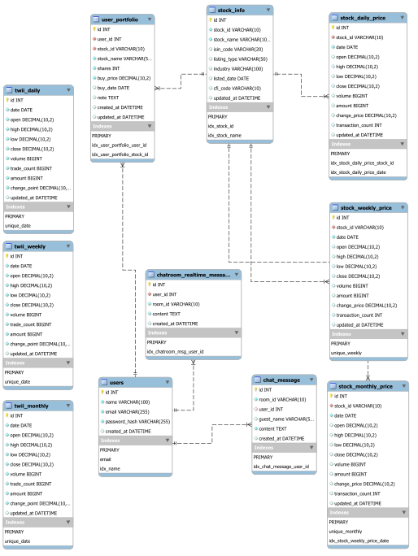

# [StockPulse](https://stock-pulse.site/)
StockPulse is a real-time stock market discussion and portfolio tracking platform.  
It provides daily index data and individual stock prices for the Taiwan stock market, along with discussion channels and investment portfolio management.
## Features
- **Market Index & Stock Price Lookup**
  - View daily data of the Taiwan Capitalization Weighted Stock Index (TAIEX)
  - Query price trends of all listed and OTC stocks

- **Discussion System**
  - Real-time discussion under the index and individual stock pages
  - Join a general-purpose chatroom to exchange strategies with other users

- **Investment Portfolio**
  - Add and manage personal holdings
  - Track real-time profit & loss based on current stock prices
  - View aggregated portfolio performance
## Technology Stack
### Frontend
- Vue 3
- Vite
- Chart rendering: Lightweight-Charts
- Realtime messaging: WebSocket
### Backend
- FastAPI (Python)
- MySQL + SQLAlchemy
- JWT-based authentication
### Deployment
- Frontend: AWS S3 + CloudFront CDN
- Backend: Docker on EC2
- Database: AWS RDS (MySQL)
- Reverse proxy: Nginx
## Entity Relationship Diagram (ERD)

#### The database design in StockPulse includes the following key concepts:

- `twii_index_daily`, `stock_daily_price`:  
Store daily price data for the TAIEX index and all listed stocks.

- `twii_index_weekly/monthly`, `stock_weekly_price/monthly_price`:  
Weekly and monthly data are automatically converted from daily data using batch scripts.

- `users`:  
User account table, including authentication and timestamps.

- `user_portfolio`:  
Linked to users via foreign key. Stores user-owned stock positions, buy price, quantity, and optional notes.

- `messages`, `chat_rooms`:  
Discussion system for both the index and individual stock pages.messages are linked to users and assigned to a chat_room by stock ID or general use.

### Additional Notes:

- All stock price tables are indexed by stock ID and date for efficient queries.

- Historical price crawling and data transformation scripts are run daily after market close.

## Deployment Architecture

StockPulse is deployed on AWS using Docker and CI/CD automation.

### CI/CD Flow

- Developers push code to GitLab

- GitLab triggers CI/CD pipelines

- Frontend: Build and upload static Vue files to S3, delivered via CloudFront CDN

- Backend: Dockerized FastAPI image is deployed to EC2

### Backend Stack

- FastAPI handles RESTful APIs and WebSocket for real-time messaging

- MySQL hosted on AWS RDS for relational data storage

- Docker ensures reproducible environments and simplifies deployment

### Scheduled Tasks

#### A daily crawling script runs after market close to:

- Fetch new TAIEX and stock prices from the Taiwan Stock Exchange

- Update database records for daily/weekly/monthly intervals

## Demo
### HomePage
- Test account login is available on the homepage for quick access.
- Search for stock symbols to view individual stock prices and charts.

### TwiiPage
- View daily, weekly, and monthly charts of the TAIEX index
- Join discussions directly on the index and individual stock pages

### StockPage
- View daily, weekly, and monthly charts of the TAIEX index and individual stocks
- Search stocks by ID, name, or filter by industry category
- Join discussions on the index and individual stock pages
- Manage personal investment portfolio with real-time profit/loss tracking

### PortfolioPage
- Edit personal investment portfolio with real-time P/L updates based on market open prices

### Real-Time Chatroom
- Real-time chatroom with instant messaging and searchable stock channel list

## Contact
- Author: Conan Chang (張兆丞)
- Email: changchaocheng870405@gmail.com
- GitHub: [Translation-regulator](https://github.com/Translation-regulator) 